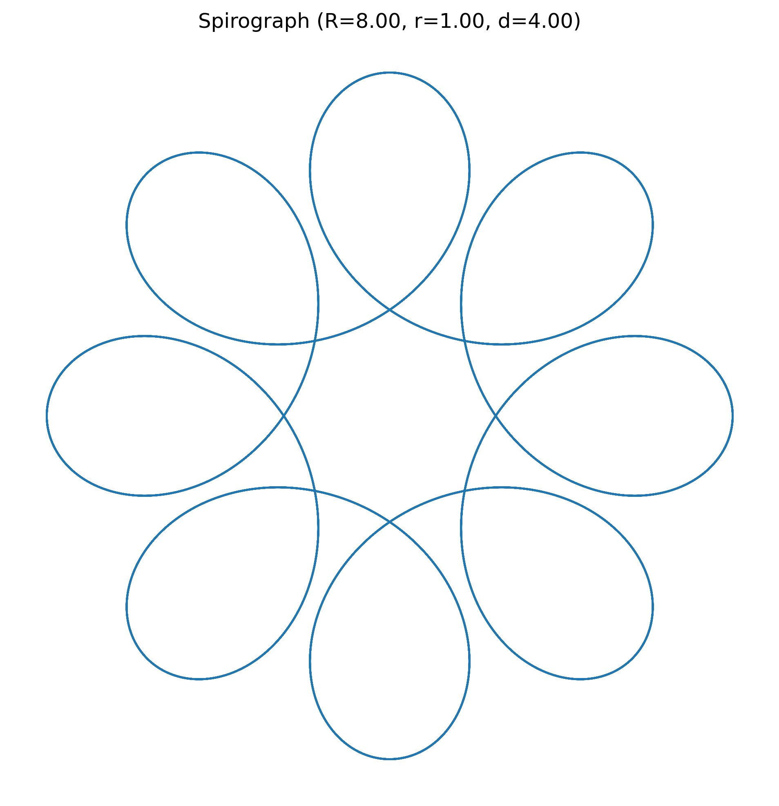

# Spirograph Generator

A collection of Python scripts for generating mathematical spirograph patterns using matplotlib. Create beautiful, customizable geometric designs with these interactive tools.


## Features

- **Simple Spirograph**: Basic implementation with fixed parameters for quick generation
- **Interactive Spirograph**: Real-time parameter adjustment with sliders and precise numeric inputs
- **Colorful Spirograph**: Multiple overlapping patterns with vibrant color gradients

## What is a Spirograph?

A spirograph is a geometric drawing toy that produces mathematical curves known as hypotrochoids and epitrochoids. The mathematical equations behind spirographs create beautiful patterns by rolling one circle inside or outside of another circle.

The three key parameters that control a spirograph are:
- **R**: Radius of the fixed circle
- **r**: Radius of the moving circle 
- **d**: Distance from the center of the moving circle to the drawing point

## Requirements

- Python 3.9+
- matplotlib
- numpy

## Installation

1. Clone this repository:
   ```bash
   git clone https://github.com/jackChallis/spirograph_generator.git
   cd spirograph_generator
   ```

2. Create a virtual environment:
   ```bash
   python -m venv venv
   ```

3. Activate the virtual environment:
   - On macOS/Linux:
     ```bash
     source venv/bin/activate
     ```
   - On Windows:
     ```bash
     venv\Scripts\activate
     ```

4. Install dependencies:
   ```bash
   pip install -r requirements.txt
   ```

## Usage

### Simple Spirograph

Generate a basic spirograph with fixed parameters:

```bash
python src/spirograph.py
```

This creates a single spirograph with predefined parameters and saves it to `spirograph.png`.

### Interactive Spirograph

Create spirographs with adjustable parameters:

```bash
python src/interactive_spirograph.py
```

Features:
- Adjust R, r, and d using sliders
- Type exact values for precise control
- Save high-resolution images of your designs
- Reset to default values

### Colorful Spirograph

Generate multiple overlapping spirographs with color gradients:

```bash
python src/colorful_spirograph.py
```

This creates a vibrant composition of multiple spirograph patterns and saves it to `colorful_spirograph.png`.

## Mathematical Background

The parametric equations for a spirograph are:

```
x(t) = (R - r) * cos(t) + d * cos((R - r) * t / r)
y(t) = (R - r) * sin(t) - d * sin((R - r) * t / r)
```

Where:
- t is the parameter that varies from 0 to 2π * LCM(r, R)/r
- LCM is the least common multiple

Different parameter combinations create different patterns:
- When r/R is rational (can be expressed as a fraction), the pattern eventually closes
- When d = r, the pattern is called a hypotrochoid
- Integer ratios of R and r often create the most visually appealing patterns

## Example Designs

### Basic Patterns
| Parameters | Image |
|------------|-------|
| R=8, r=1, d=4 |  |
| R=5, r=3, d=4 |  |
| R=7, r=2, d=3 |  |

### Colorful Compositions


## Customization

You can modify the source code to:
- Change the color schemes
- Adjust the line thickness
- Export in different file formats
- Create animations
- Implement additional parameters

## Contributing

Contributions are welcome! Please feel free to submit a Pull Request.

## License

This project is licensed under the MIT License - see the LICENSE file for details.

## Acknowledgements

- Inspired by the classic Spirograph toy invented by Denys Fisher
- Mathematical concepts from parametric equations and geometry
- Built with matplotlib and numpy
